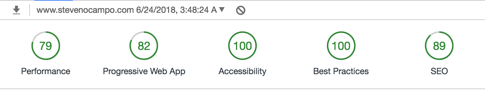
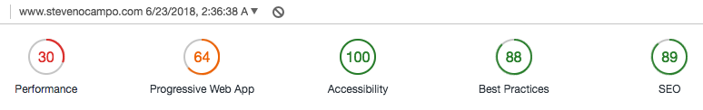
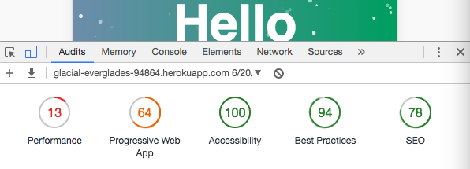

# My Portfolio Site :)
## Made Via React.js :sparkles:*Magic*:sparkles:

> It's a work in progress, just as I am. Slowly but surely..

***
## Performance Audit
> I believe many factors (e.g. internet connection speed) come into play during these audits. So they do fluxuate.

`Current Audit`

`Progress Audit`

`Initial Audit`

#### To Do
* Fontawesome from CDN to local
* Tweak media queries
* Continue adding portfolio pieces
